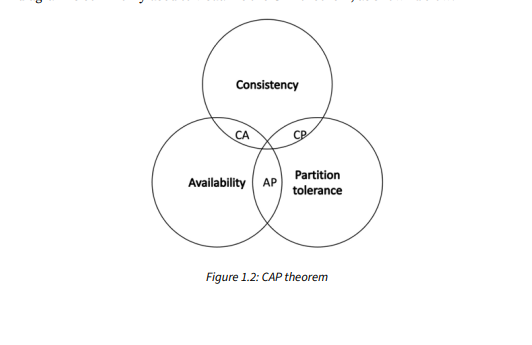

## Distributed systems

A distrubuted system is a computing paradigm whereby two or more node work together in a cordinated fashoin to achieve a common outcome.

It composed of process `NODES` and Channels ` communication channels` where nodes communicate by passing message.A blockchain is a message passing distributed system.

**A Node** is an individual player `computer` in a distributed systems.All nodes send and recieve messeges to and from each other.

- Nodes can be honesty,faulty and malicious and the have memory and processor.
- a node that exhebits arbitrary behaviour is called a **bzyantine node**

  - ✔️ **The Byzantine Generals problem**

  In 1982, a thought experiment was proposed by Lamport et al. in their research paper,
  [The Byzantine Generals Problem](https://www.microsoft.com/en-us/research/publication/byzantine-generals-problem/)
  In this problem, a group of army generals who lead different parts of the Byzantine army
  is planning to attack or retreat from a city. The only way of communicating with them is
  via a messenger. They need to agree to strike at the same time to win. The issue is that one
  or more generals might be traitors who could send a misleading message. Moreover, the
  messenger could be captured by the city, resulting in no message delivery. Therefore, there
  is a need for a viable mechanism that allows agreement among the generals, even in the
  presence of the treacherous ones, and message loss, so that the attack can still take place
  at the same time. As an analogy for distributed systems, the generals can be considered
  as honest nodes, the traitors as Byzantine nodes (that is, nodes with arbitrary behavior),
  the messenger can be thought of as a channel of communication with the generals, and
  a captured messenger as a delayed or lost message. Several solutions were presented to
  this problem in the paper by Lamport et al. in 1982.

  - Distrubuted system are so challenging to design .It has been proven it cant have tree properties ,consistency ,availability ,partition tolerance. - this principler is called **CAP Theorem.**

## CAP theorem

The theory states that any distributed system cannot have consistency,availability and partition tolerant simultaneously.

1.  **Consistency** - this property ensures that all nodes in a distributed system has the same up-to-date state of data. This is achived by means of consesus algorythim .This is also called **state Machine Replication.**

2.**Availabilty** - this is means the nodes are up and running , accessible and are
accepting request and responding
with data without any failures and when required. 
    
 3. **Partition tolerance** - ensures that incase a group of nodes is unable to communicate with other nodes due to network failures ,the distributed system continue to operate correctly .

*A Venn diagram is commonly used to visualize the CAP theorem, as shown below:*

`In blockchains, consistency is sacrificed in favor of availability and partition tolerance. In this scenario, consistency (C) in the blockchain is not achieved simultaneously with partition tolerance (P) and
availability (A), but it is achieved over time. This is called eventual consistency, where consistency is
achieved due to validation from multiple nodes over time. There can be a temporary disagreement
between nodes on the final state, but it is eventually agreed upon. For example, in Bitcoin, multiple
transaction confirmations are fast.com’s DNS address could not be found. Diagnosing the problem.
required to achieve a good confidence level that transactions may not
be rolled back in the future. Eventually, a consistent view of transaction history is available in all
nodes. Multiple confirmations of a transaction over time provide eventual consistency in Bitcoin. For
this purpose, the process of mining was introduced in Bitcoin. Mining is a process that facilitates the
achievement of consensus by using the Proof of Work (PoW) algorithm.